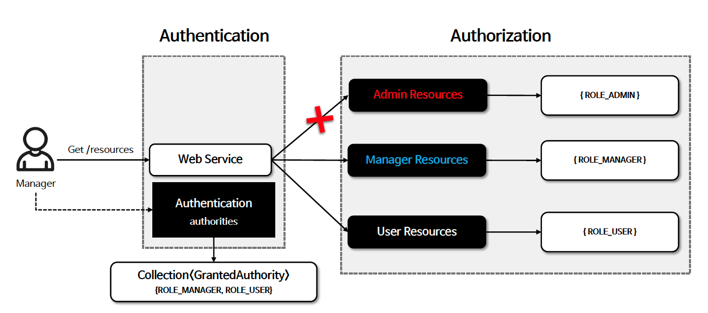

# ☘️ 인가 - Authorization

---

## 📖 내용
- `Authorization`
  - 인가 즉 권한 부여는 특정 자원에 접근할 수 있는 사람을 결정하는 것을 의미합니다.
  - Spring Security 는 `GrantedAuthority` 클래스를 통해 권한 목록을 관리하고 있으며 사용자의 `Authentication` 객체와 연결합니다.


<sub>※ 이미지 출처: [정수원님의 인프런 강의](https://www.inflearn.com/course/%EC%8A%A4%ED%94%84%EB%A7%81-%EC%8B%9C%ED%81%90%EB%A6%AC%ED%8B%B0-%EC%99%84%EC%A0%84%EC%A0%95%EB%B3%B5/dashboard)</sub>

- `GrantedAuthority`
  - Spring Security는 `Authentication` 에 `GrantedAuthority` 권한 목록을 저장하며 이를 통해 인증 주체에게 부여된 권한을 사용하도록 합니다.
  - `GrantedAuthority` 객체는 `AuthenticationManager` 에 의해 `Authentication` 객체에 저장되며 Spring Security는 인가 결정을 내릴 때 `AuthorizatioinManager`를 사용하여 인증 주체로부터 `GrantedAuthority` 객체를 읽어들여 처리하게 된다
  - 기본 구현체로 `SimpleGrantedAuthority` 가 제공됩니다.

- `GrantedAuthorityDefaults` 클래스를 통해 권한 접두사를 설정할 수 있습니다. (default: `ROLE_`)

---

## 🔍 중심 로직

```java
package org.springframework.security.core;

...

public interface GrantedAuthority extends Serializable {
    String getAuthority();
}
```

```java
package org.springframework.security.core.authority;

...

public final class SimpleGrantedAuthority implements GrantedAuthority {
    private static final long serialVersionUID = 620L;
    private final String role;

    public SimpleGrantedAuthority(String role) {
        Assert.hasText(role, "A granted authority textual representation is required");
        this.role = role;
    }

    public String getAuthority() {
        return this.role;
    }

    public boolean equals(Object obj) {
        if (this == obj) {
            return true;
        } else if (obj instanceof SimpleGrantedAuthority) {
            SimpleGrantedAuthority sga = (SimpleGrantedAuthority)obj;
            return this.role.equals(sga.getAuthority());
        } else {
            return false;
        }
    }

    public int hashCode() {
        return this.role.hashCode();
    }

    public String toString() {
        return this.role;
    }
}
```

```java
package org.springframework.security.config.core;

public final class GrantedAuthorityDefaults {
    private final String rolePrefix;

    public GrantedAuthorityDefaults(String rolePrefix) {
        this.rolePrefix = rolePrefix;
    }

    public String getRolePrefix() {
        return this.rolePrefix;
    }
}
```

```java
@Bean
static GrantedAuthorityDefaults grantedAuthorityDefaults() {
    return new GrantedAuthorityDefaults("MYPREFIX_");
}
```

📌
- `GrantedAuthorityDefaults`를 통해 권한 접두사를 설정하면 다음과 같이 권한이 부여됩니다.
  - `ROLE_USER` -> `MYPREFIX_ROLE_USER`
  - `ROLE_ADMIN` -> `MYPREFIX_ROLE_ADMIN`
- `SimpleGrantedAuthority`는 기본적으로 'ROLE_' 접두사를 사용하기 때문에 접두사 설정시 `roles()` 대신 `authorities()`를 사용하여 직접 접두사까지 설정해야 합니다.

---

## 📂 참고할만한 자료

