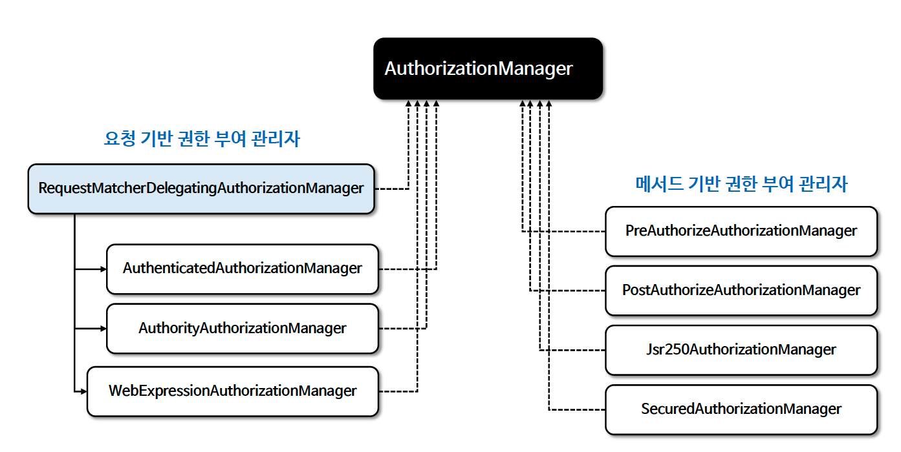

# ☘️ 인가 관리자 이해 - AuthorizationManager

---

## 📖 내용
- `AuthorizationManager`는 인증된 사용자가 요청 자원에 접근할 수 있는지 여부를 결정하는 인터페이스로서 인증된 사용자의 권한 정보와 요청 자원의 보안 요구 사항을 기반으로 권한 부여 결정을 내립니다.
- `AuthorizationManager` 는 Spring Security의 요청 기반, 메소드 기반의 인가 구성 요소에서 호출되며 최종 액세스 제어 결정을 수행합니다.
- `AuthorizationManager` 는 Spring Security의 필수 구성 요소로서 권한 부여 처리는 `AuthorizationFilter` 를 통해 이루어지며 `AuthorizationFilter` 는 `AuthorizationManager` 를 호출하여 권한 부여 결정을 내립니다.

- `AuthorizationManager` 계층 구조


<sub>※ 이미지 출처: [정수원님의 인프런 강의](https://www.inflearn.com/course/%EC%8A%A4%ED%94%84%EB%A7%81-%EC%8B%9C%ED%81%90%EB%A6%AC%ED%8B%B0-%EC%99%84%EC%A0%84%EC%A0%95%EB%B3%B5/dashboard)</sub>

- 요청 기반 권한 부여 관리자
  - `AuthorityAuthorizationManager`
    - 특정 권한을 가진 사용자에게만 접근을 허용합니다.. 주로 사용자의 권한(예: ROLE_USER, ROLE_ADMIN)을 기반으로 접근을 제어합니다.
  - `AuthenticatedAuthorizationManager`
    - 인증된 사용자에게 접근을 허용합니다.. 이 클래스는 사용자가 시스템에 로그인했는지 여부를 기준으로 결정합니다.
  - `WebExpressionAuthorizationManager`
    - 웹 보안 표현식을 사용하여 권한을 관리합니다.. 예를 들어, "hasRole('ADMIN')" 또는 "hasAuthority('WRITE_PERMISSIONS')"과 같은 표현식을 사용할 수 있습니다.
  - `RequestMatcherDelegatingAuthorizationManager`
    - 인가설정에서 지정한 모든 요청패턴과 권한 규칙을 매핑한 정보를 가지고 있으며 권한 검사 시 가장 적합한 `AuthorizationManager` 구현체를 선택해 위임합니다.

- 메서드 기반 권한 부여 관리자
  - `PreAuthorizeAuthorizationManager`
    - 메소드 실행 전에 권한을 검사합니다. `@PreAuthorize` 어노테이션과 함께 사용되며, 메소드 실행 전에 사용자의 권한을 확인합니다.
  - `PostAuthorizeAuthorizationManager`
    - 메소드 실행 후에 권한을 검사합니다. `@PostAuthorize` 어노테이션과 함께 사용되며, 메소드 실행 후 결과에 따라 접근을 허용하거나 거부합니다.
  - `Jsr250AuthorizationManager`
    - JSR-250 어노테이션(`@RolesAllowed`, `@DenyAll`, `@PermitAll`)을 사용하여 권한을 관리합니다.
  - `SecuredAuthorizationManager`
    - `@Secured` 어노테이션을 사용하여 메소드 수준의 보안을 제공합니다. 이 어노테이션은 특정 권한을 가진 사용자만 메소드에 접근할 수 있게 합니다.

---

## 🔍 중심 로직

```java
package org.springframework.security.authorization;

...

@FunctionalInterface
public interface AuthorizationManager<T> {
    default void verify(Supplier<Authentication> authentication, T object) {
        AuthorizationDecision decision = this.check(authentication, object);
        if (decision != null && !decision.isGranted()) {
            throw new AuthorizationDeniedException("Access Denied", decision);
        }
    }

    /** @deprecated */
    @Nullable
    @Deprecated
    AuthorizationDecision check(Supplier<Authentication> authentication, T object);

    @Nullable
    default AuthorizationResult authorize(Supplier<Authentication> authentication, T object) {
        return this.check(authentication, object);
    }
}
```

📌
- `check()`
  - 권한 부여 결정을 내릴 때 필요한 모든 정보 (인증객체, 체크 대상(권한 정보, 요청정보, 호출정보 등...))가 전달됩니다.
  - 액세스가 허용되면 true를 포함하는 `AuthorizationDecision`, 거부되면 false를 포함하는 `AuthorizationDecision`, 결정을 내릴 수 없는 경우 `null`을 반환합니다.
- `verify()`
  - `check()`를 호출해서 반환된 값이 false를 가진 `AuthorizationDecision`인 경우 `AccessDeniedException`을 발생시킵니다.

- Spring Security 6.4 부터는 `check()` 메서드가 deprecated 되었으며 대신 `authorize()` 메서드를 사용해야 합니다.
---

## 📂 참고할만한 자료

