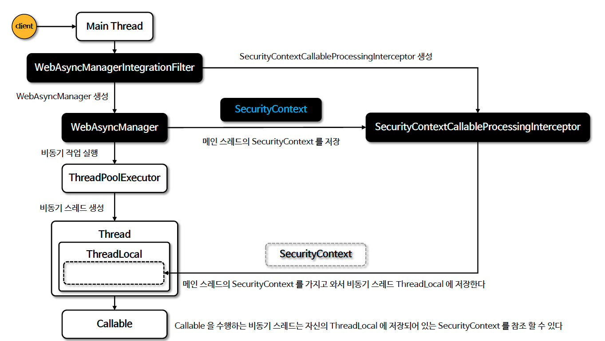

# ☘️ Spring MVC 비동기 통합 - WebAsyncManagerIntegrationFilter

---

## 📖 내용
- Spring Security 는 Spring MVC Controller 에서 Callable 을 실행하는 비동기 스레드에 SecurityContext 를 자동으로 설정하도록 지원합니다.
- Spring Security 는 WebAsyncManager 와 통합하여 SecurityContextHolder 에서 사용 가능한 SecurityContext 를 Callable 에서 접근 가능하도록 합니다.

- `̈WebAsyncManagerIntegrationFilter`
  - SecurityContext 와 WebAsyncManager 사이의 통합을 제공하며 WebAsyncManager 를 생성하고 SecurityContextCallableProcessingInterceptor 를 WebAsyncManager 에 등록합니다.

- `̈WebAsyncManager`
  - 스레드 풀의 비동기 스레드를 생성하고 Callable 를 받아 실행시키는 주체로서 등록된 SecurityContextCallableProcessingInterceptor 를 통해 현재 스레드가 보유하고 있는 SecurityContext 객체를 비동기 스레드의 ThreadLocal 에 저장시킵니다.


<sub>※ 이미지 출처: [정수원님의 인프런 강의](https://www.inflearn.com/course/%EC%8A%A4%ED%94%84%EB%A7%81-%EC%8B%9C%ED%81%90%EB%A6%AC%ED%8B%B0-%EC%99%84%EC%A0%84%EC%A0%95%EB%B3%B5/dashboard)</sub>

---

## 🔍 중심 로직

```java
package org.springframework.security.web.context.request.async;

...

public final class WebAsyncManagerIntegrationFilter extends OncePerRequestFilter {
    private static final Object CALLABLE_INTERCEPTOR_KEY = new Object();
    private SecurityContextHolderStrategy securityContextHolderStrategy = SecurityContextHolder.getContextHolderStrategy();

    public WebAsyncManagerIntegrationFilter() {
    }

    protected void doFilterInternal(HttpServletRequest request, HttpServletResponse response, FilterChain filterChain) throws ServletException, IOException {
        WebAsyncManager asyncManager = WebAsyncUtils.getAsyncManager(request);
        SecurityContextCallableProcessingInterceptor securityProcessingInterceptor = (SecurityContextCallableProcessingInterceptor)asyncManager.getCallableInterceptor(CALLABLE_INTERCEPTOR_KEY);
        if (securityProcessingInterceptor == null) {
            SecurityContextCallableProcessingInterceptor interceptor = new SecurityContextCallableProcessingInterceptor();
            interceptor.setSecurityContextHolderStrategy(this.securityContextHolderStrategy);
            asyncManager.registerCallableInterceptor(CALLABLE_INTERCEPTOR_KEY, interceptor);
        }

        filterChain.doFilter(request, response);
    }

    public void setSecurityContextHolderStrategy(SecurityContextHolderStrategy securityContextHolderStrategy) {
        Assert.notNull(securityContextHolderStrategy, "securityContextHolderStrategy cannot be null");
        this.securityContextHolderStrategy = securityContextHolderStrategy;
    }
}
```

```java
package org.springframework.security.web.context.request.async;

...

public final class SecurityContextCallableProcessingInterceptor implements CallableProcessingInterceptor {
    private volatile SecurityContext securityContext;
    private SecurityContextHolderStrategy securityContextHolderStrategy = SecurityContextHolder.getContextHolderStrategy();

    public SecurityContextCallableProcessingInterceptor() {
    }

    public SecurityContextCallableProcessingInterceptor(SecurityContext securityContext) {
        Assert.notNull(securityContext, "securityContext cannot be null");
        this.setSecurityContext(securityContext);
    }

    public <T> void beforeConcurrentHandling(NativeWebRequest request, Callable<T> task) {
        if (this.securityContext == null) {
            this.setSecurityContext(this.securityContextHolderStrategy.getContext());
        }

    }

    public <T> void preProcess(NativeWebRequest request, Callable<T> task) {
        this.securityContextHolderStrategy.setContext(this.securityContext);
    }

    public <T> void postProcess(NativeWebRequest request, Callable<T> task, Object concurrentResult) {
        this.securityContextHolderStrategy.clearContext();
    }

    public void setSecurityContextHolderStrategy(SecurityContextHolderStrategy securityContextHolderStrategy) {
        Assert.notNull(securityContextHolderStrategy, "securityContextHolderStrategy cannot be null");
        this.securityContextHolderStrategy = securityContextHolderStrategy;
    }

    private void setSecurityContext(SecurityContext securityContext) {
        this.securityContext = securityContext;
    }
}
```

📌


---

## 📂 참고할만한 자료

