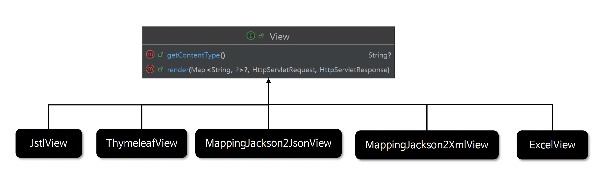
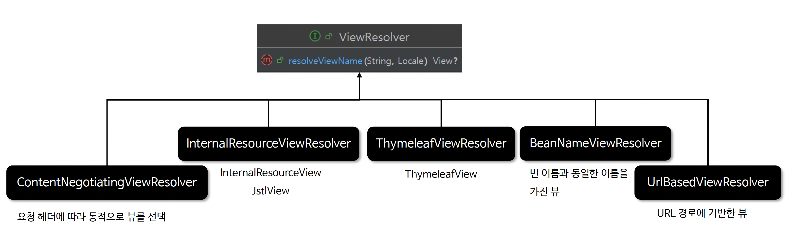
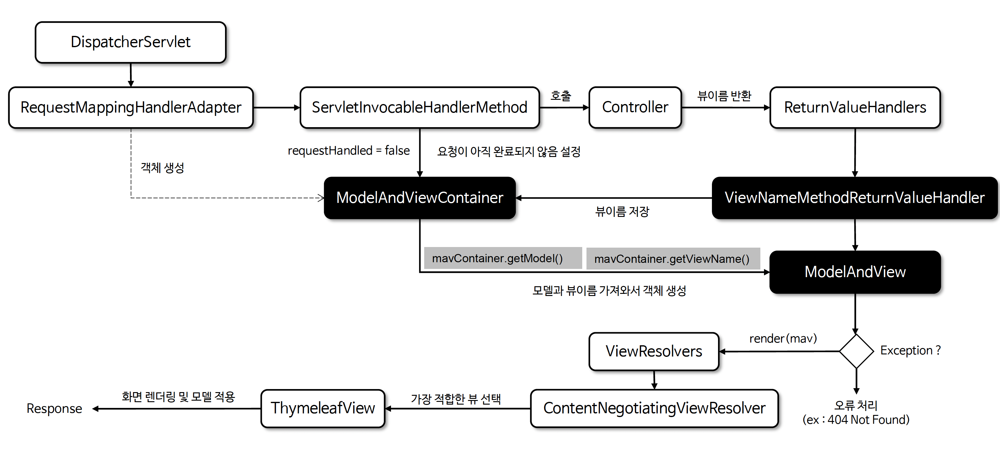

# ☘️ View_ViewResolver

---

## 📖 내용

### View

- 스프링 MVC 에서 View 는 웹 페이지를 사용자에게 보여주는 역할을 한다
- View 는 컨트롤러가 처리한 데이터를 사용자에게 보여주는 화면이며 사용자가 볼 수 있는 HTML, JSON 같은 결과물을 만들어주는 역할을 한다

- 계층도

<sub>출처: 인프런</sub>


---

### ViewResolver
- 스프링의 View 시스템은 ViewResolver 와 View 인터페이스를 기반으로 동작하며 ViewResolver 는 특정 URL 요청에 따라 어떤 View를 사용할지를 결정하는 역할을 하고
  View는 최종적으로 데이터를 렌더링하여 클라이언트에 반환한다


- 계층도

<sub>출처: 인프런</sub>

---

### ViewResolver 구현체
- 스프링 MVC 는 초기화 시점에 자동으로 기본 ViewResolver 구현체를 생성하고 등록한다
- ContentNegotiatingViewResolver, InternalResourceViewResolver, ViewResolverComposite, 그리고 타임리프 의존성이 추가 되면 ThymeleafViewResolver 까지 포함한다
- ContentNegotiatingViewResolver 가 가장 우선 순위가 높으며 이 클래스 안에 ThymeleafViewResolver, InternalResourceViewResolver, ViewResolverComposite 가 목록으로
  저장되어 있으며 ThymeleafViewResolver 가 우선순위가 가장 높다

---

### ViewResolver 의 View 결정 기준
- ContentNegotiatingViewResolver 은 각 ViewResolver 에 의해 생성된 View 객체들을 순회하며 가장 적합한 View 를 결정해서 반환한다


- 클라이언트의 요청 헤더에 포함된 MediaType (Accept 헤더) 목록과 View 의 Content-Type 을 비교해서 서로 호환이 되는 MediaType 이 존재하는지 확인한다
- MediaType 이 호환되는 첫 번째 View 가 최종 선택되어 반환되고 적합한 View 가 없으면 다음 View 로 넘어간다. 만약 View 가 없으면 예외가 발생한다
- 만약 ThymeleafView 와 InternalResourceView 모두 선택 대상인데 ThymeleafView 가 먼저 선택되면 InternalResourceView 는 호환 여부를 검사하지 않는다

---

### View vs HttpMessageConverter

| View                         | HttpMessageConverter                           |
|------------------------------|------------------------------------------------|
| 템플릿 기반 HTML 렌더링              | REST API 응답 데이터 변환                             |
| 모델 데이터를 기반으로 HTML 등으로 변환     | Java 객체를 JSON, Text 등으로 변환                     |
| @Controller, @RequestMapping | @RestController, @ResponseBody, ResponseEntity |
| HTML, JSP와 같은 화면 렌더링         | JSON, Text 를 포함한 API 응답                        |
| ViewResolver 에 의해 View 선택    | HttpMessageConverter는 ViewResolver 와 독립적       |

---

### View / ViewResolver 흐름도

<sub>출처: 인프런</sub>

---

## 🔍 중심 로직

```java
package org.springframework.web.servlet;

// imports

public interface View {

	String RESPONSE_STATUS_ATTRIBUTE = View.class.getName() + ".responseStatus";

	String PATH_VARIABLES = View.class.getName() + ".pathVariables";

	String SELECTED_CONTENT_TYPE = View.class.getName() + ".selectedContentType";

	@Nullable
	default String getContentType() {
		return null;
	}

	void render(@Nullable Map<String, ?> model, HttpServletRequest request, HttpServletResponse response)
			throws Exception;

}
```

```java
package org.springframework.web.servlet;

// imports

public interface ViewResolver {

	@Nullable
	View resolveViewName(String viewName, Locale locale) throws Exception;

}
```

📌

---

## 💬 코멘트

---
