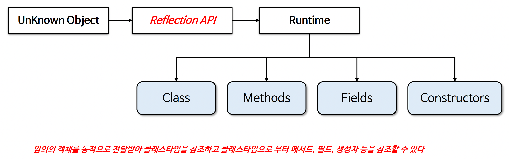

# ☘️ 자바 리플렉션 이해

---

## 📖 내용

- 리플렉션(Reflection)은 어플리케이션의 실행 시점에 클래스, 메서드, 필드 등을 분석하고 조작할 수 있는 기능을 제공하는 강력한 도구로서 객체의 클래스 타입 정보를 동적으로 가져오고 객
  체의 메서드 실행이나 필드 값을 읽고 수정하는 등의 작업을 수행할 수 있다

---

### 동작 방식

<sub>출처: 인프런</sub>

---


### 주요 클래스
- Class
  - Reflection 의 핵심 클래스로서클래스의 메타데이터를 표현한다
  - 참조 방식
    - Class.forName(String className)
      - Class<?> clazz = Class.forName("java.util.ArrayList");
    - .class 키워드
      - Class<?> clazz = String.class;
    - .getClass() 메서드
      - Class<?> clazz = str.getClass();
- Field
  - 클래스의 필드를 나타내며 필드 이름, 타입, 접근 제어자, 값을 조회 및 수정할 수 있다
  - 참조 방식
    - getDeclaredFields()
      - private 접근 제어자를 가진 필드포함
      - Field[] fields = clazz.getDeclaredFields();
    - getDeclaredField(String fieldName)
      - Field field = clazz.getDeclaredField("name");
    - getFields()
      - public 접근 제어자를 가진 필드만참조가능
      - Field[] publicFields = clazz.getFields();
- Method
  - 클래스의 메서드를 나타내며 메서드 이름, 반환 타입, 매개변수 타입, 접근 제어자 정보를 조회할 수 있으며런타임에 메서드를 실행할 수 있다
  - 참조 방식
    - getDeclaredMethods
      - private 접근 제어자를 가진 필드포함
      - Method[] methods = clazz.getDeclaredMethods();
    - getDeclaredMethod(String methodName, Class<?>... parameterTypes)
      - Method method = clazz.getDeclaredMethod("add", int.class, Object.class);
    - getMethods()
      - public 접근 제어자를 가진 필드만참조가능
      - Method[] publicMethods = clazz.getMethods(); (public 접근 제어자를 가진 필드만)
- Constructor
  - 클래스의 생성자를 나타내며 생성자 정보 조회 및 객체 생성에 사용된다
  - 참조 방식
    - getDeclaredConstructors() -private 접근 제어자를 가진 필드포함
      - Constructor<?>[] constructors = clazz.getDeclaredConstructors();
    - getDeclaredConstructor(Class<?>... parameterTypes)
      - Constructor<?> constructor = clazz.getDeclaredConstructor(String.class);
    - getConstructors() -public 접근 제어자를 가진 필드만참조가능
      - Constructor<?>[] publicConstructors = clazz.getConstructors();; (public 접근 제어자를 가진 필드만)


<sub>출처: 인프런</sub>

---

## 🔍 중심 로직

```java
```

📌

---

## 💬 코멘트

---
