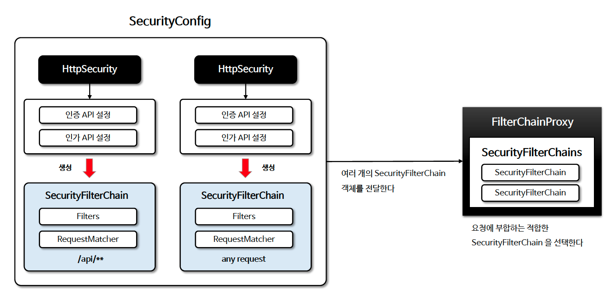
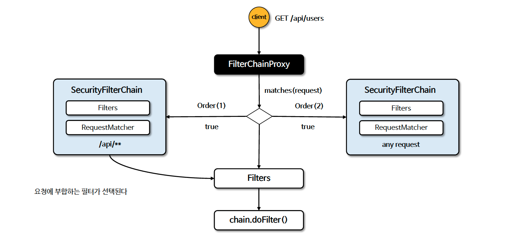

# ☘️ 다중 보안 설정

---

## 📖 내용
- Spring Security 는 여러 `SecurityFilterChain` @Bean 을 등록해서 다중 보안 기능을 구성 할 수 있는데 이 떄 `@Order`를 사용하여 순서를 설정해줘야 합니다.


<sub>※ 이미지 출처: [정수원님의 인프런 강의](https://www.inflearn.com/course/%EC%8A%A4%ED%94%84%EB%A7%81-%EC%8B%9C%ED%81%90%EB%A6%AC%ED%8B%B0-%EC%99%84%EC%A0%84%EC%A0%95%EB%B3%B5/dashboard)</sub>


<sub>※ 이미지 출처: [정수원님의 인프런 강의](https://www.inflearn.com/course/%EC%8A%A4%ED%94%84%EB%A7%81-%EC%8B%9C%ED%81%90%EB%A6%AC%ED%8B%B0-%EC%99%84%EC%A0%84%EC%A0%95%EB%B3%B5/dashboard)</sub>

---

## 🔍 중심 로직

```java
@Configuration
@EnableWebSecurity
public class SecurityConfig {
    @Bean
    @Order(1) // @Order 를 사용하여 어떤 SecurityFilterChain 을 먼저 수행 할지 지정한다. 아래 설정보다 우선적으로 보안 기능을 수행한다
    public SecurityFilterChain apiFilterChain(HttpSecurity http) throws Exception {
        http.securityMatcher("/api/**") // HttpSecurity가 /api/로 시작하는 URL 에만 적용 된다
                .authorizeHttpRequests(authorize -> authorize.anyRequest().hasRole("ADMIN"))
                .httpBasic(withDefaults());
        return http.build();
    }

    @Bean // @Order 가 지정되지 않으면 마지막으로 간주 된다
    public SecurityFilterChain formLoginFilterChain(HttpSecurity http) throws Exception {
        http.authorizeHttpRequests(authorize -> authorize.anyRequest().authenticated()) // HttpSecurity 가 /api/ 를 제외한 모든 URL 에 적용 된다
                .formLogin(withDefaults());
        return http.build();
    }
}
```

📌
- 주로 권한별 인증/인가 처리를 달리 하고 싶은 경우 각 권한에 맞는 `SecurityFilterChain` 을 생성하여 사용합니다.

---

## 📂 참고할만한 자료

