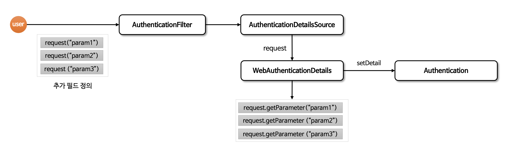

# ☘️ 회원 인증 시스템

---

## 📖 내용

- `WebAuthenticationDetails`
  - HTTP 요청과 관련된 인증 세부 정보를 포함하는 클래스로서 기본적으로 사용자의 IP 주소와 세션 ID를 가지고 있습니다.
  - 특정 인증 메커니즘에서 요청의 추가적인 정보를 인증 객체에 추가할 때 사용할 수 있으며 Authentication 객체와 함께 사용됩니다.
- `AuthenticationDetailsSource`
  - 인증 과정 중에 `Authentication` 객체에 세부 정보를 제공하는 소스 역할을 합니다.
  - `WebAuthenticationDetails` 객체를 생성하는 데 사용되며 인증 필터에서 참조합니다.


<sub>※ 이미지 출처: [정수원님의 인프런 강의](https://www.inflearn.com/course/%EC%8A%A4%ED%94%84%EB%A7%81-%EC%8B%9C%ED%81%90%EB%A6%AC%ED%8B%B0-%EC%99%84%EC%A0%84%EC%A0%95%EB%B3%B5/dashboard)</sub>

---

## 🔍 중심 로직

```java
@Getter
public class FormWebAuthenticationDetails extends WebAuthenticationDetails {

    private final String secretKey;

    public FormWebAuthenticationDetails(HttpServletRequest request) {
        super(request);
        secretKey = request.getParameter("secret_key");
    }
}
```

```java
public class FormWebAuthenticationDetailsSource implements AuthenticationDetailsSource<HttpServletRequest, WebAuthenticationDetails> {
    @Override
    public WebAuthenticationDetails buildDetails(HttpServletRequest request) {
        return new FormWebAuthenticationDetails(request);
    }
}
```

```java
// SecurityFilterChain
.formLogin(form ->
  form.loginPage("/login")
  .permitAll()
  .authenticationDetailsSource(authenticationDetailsSource)
)
```


---

## 📂 참고할만한 자료

