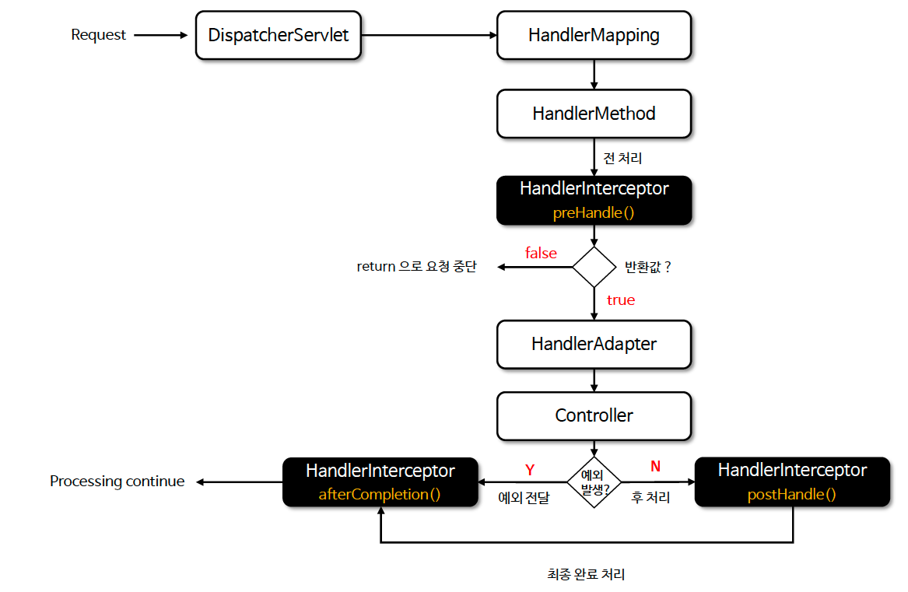

# ☘️ 인터셉터(Interceptor) (1) ~ (3)

---

## 📖 내용

- 인터셉터(Interceptor)는 핸들러의 실행 전후 또는 뷰 렌더링 이후 특정 로직을 실행할 수 있으며 HandlerInterceptor 인터페이스를 구현하여 사용할 수 있다
- 주로 여러 컨트롤러에서 공통으로 사용하는 기능을 구현하거나 재사용성을 높이고자 할 때 사용한다 (인증, 인가, 로깅, 통계집계 등..)

---

### HandlerInterceptor

- preHandle
  - 컨트롤러 실행 전에 호출되며 호출 할 Handler 객체가 인자로 전달된다
  - Boolean 반환값으로 True를 반환하면 다음 단계로 진행하고 false 를 반환하면 요청 처리를 즉시 중단한다
- postHandle
  - 컨트롤러 실행 후 뷰 렌더링 전에 호출되며 호출된 Handler 및 ModelAndView 객체가 인자로 전달된다
- afterCompletion
  - 뷰 렌더링이 완료된 후 호출되며 호출된 Handler 및 예외 발생 시 예외타입이 인자로 전달된다
  - afterCompletion 은 예외가 발생해도 무조건 호출되므로 반드시 해야 할 공통 작업이 있다면 여기서 수행하도록 한다

---

### 흐름도

<sub>※ 이미지 출처: 인프런</sub>

---

### 인터셉터 사용
- HandlerInterceptor 인터페이스 또는 HandlerInterceptorAdapter 클래스를 상속하여 구현한다
- WebMvcConfigurer 를 사용하여 인터셉터를 등록한다
  - 특정 URL 패턴에만 인터셉터를 적용하거나 제외 할 수 있다
  - order 속성을 통해 인터셉터의 호출 순서를 지정할 수 있다

---

### 다중 인터셉터 실행 호출 순서
- 여러 개의 인터셉터를 등록할 경우 등록된 순서대로 preHandle이 호출되고 등록된 역순으로 postHandle 및 afterCompletion이 호출된다

```java
@Configuration
public class WebConfig implements WebMvcConfigurer {
    @Autowired
    private FirstInterceptor firstInterceptor;
    @Autowired
    private SecondInterceptor secondInterceptor;

    @Override
    public void addInterceptors(InterceptorRegistry registry) {
        registry.addInterceptor(firstInterceptor).addPathPatterns("/**").order(1); // 먼저 등록
        registry.addInterceptor(secondInterceptor).addPathPatterns("/**").order(2); // 나중에 등록
    }
}
```


<sub>※ 이미지 출처: 인프런</sub>

---

### 다중 인터셉터 흐름 차단
- 다중 인터셉터 실행 중 이전의 인터셉터 중 하나라도 preHandle 에서 false를 반환하면 이후의 인터셉터와 핸들러는 실행되지 않고 요청 처리를 차단하며 사용자에게 적절한 응답을 반환할 수 있다
```java
@Override
public boolean preHandle(HttpServletRequest request, HttpServletResponse response, Object handler) throws Exception {
    System.out.println("[SecondInterceptor] preHandle - Request Blocked");
    response.setStatus(HttpServletResponse.SC_FORBIDDEN);
    response.getWriter().write("Access Denied");
    return false; // 요청 중단
}
```

---

### 인터셉터 체인
- 인터셉터는 HandlerExecutionChain 객체의 속성으로 한개 이상 저장되며 각 인터셉터는 체인형태로 호출되어 실행된다


<sub>※ 이미지 출처: 인프런</sub>

---

## 🔍 중심 로직

```java
package org.springframework.web.servlet;

// imports

public interface HandlerInterceptor {

	default boolean preHandle(HttpServletRequest request, HttpServletResponse response, Object handler)
			throws Exception {

		return true;
	}

	default void postHandle(HttpServletRequest request, HttpServletResponse response, Object handler,
			@Nullable ModelAndView modelAndView) throws Exception {
	}

	default void afterCompletion(HttpServletRequest request, HttpServletResponse response, Object handler,
			@Nullable Exception ex) throws Exception {
	}

}
```

📌

---

## 💬 코멘트

---
