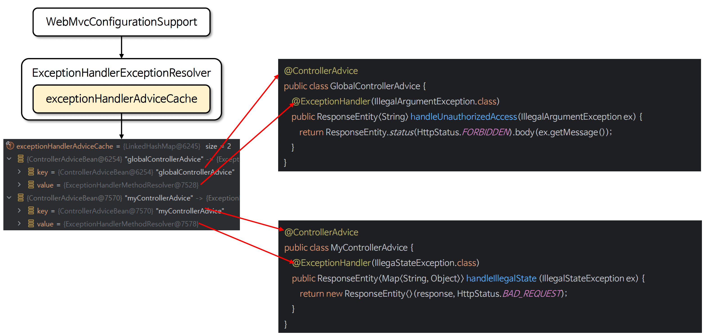

# ☘️ ExceptionHandlerExceptionResolver & @ControllerAdvice

---

## 📖 내용

- @ControllerAdvice 는 여러 컨트롤러에서 발생하는 예외를 전역적으로 처리할 수 있는 어노테이션으로 ExceptionHandlerExceptionResolver 와 결합하여 작동한다
- @ControllerAdvice 를 사용하면 어플리케이션의 모든 컨트롤러에서 발생하는 예외를 하나의 클래스에서 통합적으로 처리할 수 있으며 이를 통해 중복 코드를 제거하고 예외 흐름을 컨트롤러
  로부터 분리할 수 있어 유지보수에도 유리하다

---

### 초기화 구성
- ExceptionHandlerExceptionResolver 클래스는 초기화 시 @ControllerAdvice 대상 컨트롤러를 탐색하고 ControllerAdviceBean 객체와 ExceptionHandlerMethodResolver 객체를 매핑한다


<sub>출처: 인프런</sub>

---

### @ControllerAdvice 예외 처리 흐름도
- exceptionHandlerAdviceCache 에서 매핑된 ControllerAdviceBean 와 ExceptionHandlerMethodResolver 를 참조해서 예외 메서드를 호출하는 구조로 되어 있다


<sub>출처: 인프런</sub>

---

## 🔍 중심 로직

```java
```

📌

---

## 💬 코멘트

---
