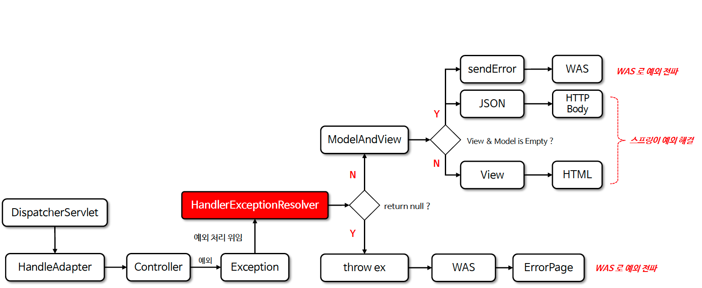

# ☘️ HandlerExceptionResolver (1) ~ (2)

---

## 📖 내용

- HandlerExceptionResolver 인터페이스는 요청 처리 중에 발생한 예외를 처리하고 그 결과를 사용자에게 보여줄 수 있는 에러 페이지로 연결해 주는 역할을 한다
- 즉 컨트롤러나 핸들러 실행 중에 문제가 생기면 이 문제를 어떻게 해결하고 어떤 에러 화면을 보여줄지를 정해주는 역할을 한다

---

### HandlerExceptionResolver 의 예외 전략
- HandlerExceptionResolver 는 RequestMappingHandleAdapter 가 핸들러 실행 후 ModelAndView 객체를 반환하는 것과 동일한 구조를 가지고 있다
- 즉 예외 상황에서도 기존의 MVC 처리 흐름을 벗어나지 않고 정상적인 흐름 안에서 예외 처리를 구현할 수 있다


<sub>※ 이미지 출처: 인프런</sub>

---

### HandlerExceptionResolver 예외 처리 흐름도

<sub>※ 이미지 출처: 인프런</sub>

---

## 🔍 중심 로직

```java
```

📌

---

## 💬 코멘트

---
