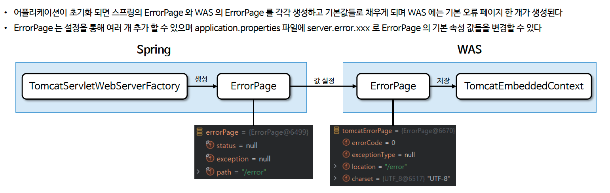

# ☘️ WAS 표준 오류 정책 - ErrorPage

---

## 📖 내용

### ErrorPage
- ErrorPage 는 WAS 에서 발생하는 예외나 특정 HTTP 상태 코드에 대해 오류 페이지를 설정하고 렌더링하는 기능을 제공하는 클래스이다
- ErrorPage 는 클라이언트에게 서버의 오류 상황을 명확히 전달하고 사용자 친화적인 메시지를 제공하기 위한 표준적인 방법이다

---

### 초기화 작업
- 어플리케이션이 초기화 되면 스프링의 ErrorPage 와 WAS 의 ErrorPage 를 각각 생성하고 기본값들로 채우게 되며 WAS 에는 기본 오류 페이지 한 개가 생성된다
- ErrorPage 는 설정을 통해 여러 개 추가 할 수 있으며 application.properties 파일에 server.error.xxx 로 ErrorPage 의 기본 속성 값들을 변경할 수 있다


<sub>※ 이미지 출처: 인프런</sub>

---

### ErrorPage 동작 방식

<sub>※ 이미지 출처: 인프런</sub>

---

### 오류 정보 전달 메커니즘
- WAS 는 오류가 발생했을 때 오류 페이지를 다시 요청하는 것 외에 오류에 대한 상세 정보를 HttpServletRequest 의 속성에 추가하여 전달한다
- HttpServletRequest 속성에 저장된 요청의 상태 코드, 발생한 예외, 오류 메시지 등을 동적으로 보여 주거나 활용할 수 있다

---

### 오류 속성

| 속성 이름                                | 설명                         | 상수 이름                                  |
|--------------------------------------|----------------------------|----------------------------------------|
| jakarta.servlet.error.status_code    | HTTP 상태 코드 (예: 404, 500 등) | RequestDispatcher.ERROR_STATUS_CODE    |
| jakarta.servlet.error.message        | 오류 메시지                     | RequestDispatcher.ERROR_MESSAGE        |
| jakarta.servlet.error.exception      | 발생한 예외 객체                  | RequestDispatcher.ERROR_EXCEPTION      |
| jakarta.servlet.error.servlet_name   | 오류가 발생한 서블릿의 이름            | RequestDispatcher.ERROR_SERVLET_NAME   |
| jakarta.servlet.error.request_uri    | 오류가 발생한 요청 URI             | RequestDispatcher.ERROR_REQUEST_URI    |
| jakarta.servlet.error.exception_type | 발생한 예외 객체의 클래스 타입          | RequestDispatcher.ERROR_EXCEPTION_TYPE |

---

## 🔍 중심 로직

```java
package org.apache.tomcat.util.descriptor.web;

// imports

public class ErrorPage extends XmlEncodingBase implements Serializable {

    private static final long serialVersionUID = 2L;

    private int errorCode = 0;

    private String exceptionType = null;

    private String location = null;

    public int getErrorCode() {
        return this.errorCode;
    }

    public void setErrorCode(int errorCode) {
        this.errorCode = errorCode;
    }

    public void setErrorCode(String errorCode) {

        try {
            this.errorCode = Integer.parseInt(errorCode);
        } catch (NumberFormatException nfe) {
            throw new IllegalArgumentException(nfe);
        }
    }

    public String getExceptionType() {
        return this.exceptionType;
    }

    public void setExceptionType(String exceptionType) {
        this.exceptionType = exceptionType;
    }

    public String getLocation() {
        return this.location;
    }
    
    public void setLocation(String location) {
        this.location = UDecoder.URLDecode(location, getCharset());
    }

    @Override
    public String toString() {
        StringBuilder sb = new StringBuilder("ErrorPage[");
        if (exceptionType == null) {
            sb.append("errorCode=");
            sb.append(errorCode);
        } else {
            sb.append("exceptionType=");
            sb.append(exceptionType);
        }
        sb.append(", location=");
        sb.append(location);
        sb.append(']');
        return sb.toString();
    }

    public String getName() {
        return Objects.requireNonNullElseGet(exceptionType, () -> Integer.toString(errorCode));
    }

}
```

📌

---

## 💬 코멘트

---
