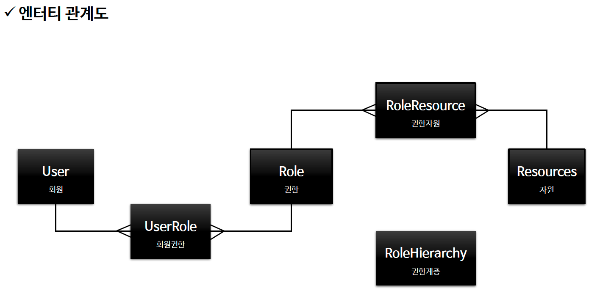
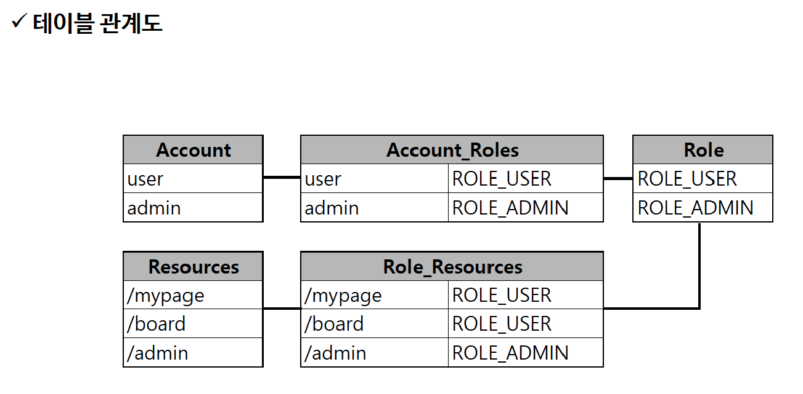
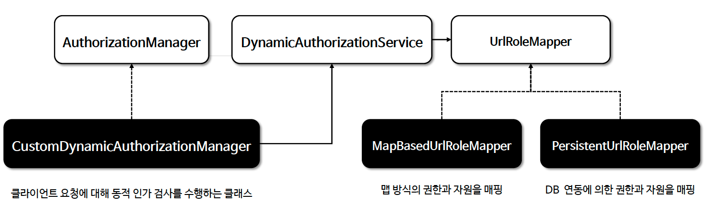
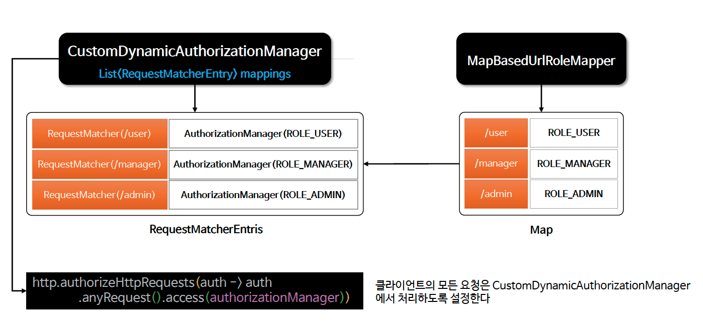

# ☘️ 회원 관리 시스템

---

## 📖 내용


<sub>※ 이미지 출처: [정수원님의 인프런 강의](https://www.inflearn.com/course/%EC%8A%A4%ED%94%84%EB%A7%81-%EC%8B%9C%ED%81%90%EB%A6%AC%ED%8B%B0-%EC%99%84%EC%A0%84%EC%A0%95%EB%B3%B5/dashboard)</sub>


<sub>※ 이미지 출처: [정수원님의 인프런 강의](https://www.inflearn.com/course/%EC%8A%A4%ED%94%84%EB%A7%81-%EC%8B%9C%ED%81%90%EB%A6%AC%ED%8B%B0-%EC%99%84%EC%A0%84%EC%A0%95%EB%B3%B5/dashboard)</sub>

---

<details>
<summary>1. 프로그래밍 방식의 인가 구현 - 메모리 기반 (Map)</summary>
<div markdown="1">


<sub>※ 이미지 출처: [정수원님의 인프런 강의](https://www.inflearn.com/course/%EC%8A%A4%ED%94%84%EB%A7%81-%EC%8B%9C%ED%81%90%EB%A6%AC%ED%8B%B0-%EC%99%84%EC%A0%84%EC%A0%95%EB%B3%B5/dashboard)</sub>


<sub>※ 이미지 출처: [정수원님의 인프런 강의](https://www.inflearn.com/course/%EC%8A%A4%ED%94%84%EB%A7%81-%EC%8B%9C%ED%81%90%EB%A6%AC%ED%8B%B0-%EC%99%84%EC%A0%84%EC%A0%95%EB%B3%B5/dashboard)</sub>

## 🔍 중심 로직

```java
package com.inflearn.security.config.security.mapper;

...

public interface UrlRoleMapper {
    Map<String, String> getUrlRoleMappings();
}
```

```java
package com.inflearn.security.config.security.mapper;

...

public class MapBasedUrlRoleMapper implements UrlRoleMapper{

    private final LinkedHashMap<String, String> urlRoleMappings = new LinkedHashMap<>();

    @Override
    public Map<String, String> getUrlRoleMappings() {
        urlRoleMappings.put("/", "permitAll");
        urlRoleMappings.put("/css/**", "permitAll");
        urlRoleMappings.put("/js/**", "permitAll");
        urlRoleMappings.put("/images/**", "permitAll");
        urlRoleMappings.put("/favicon.*", "permitAll");
        urlRoleMappings.put("/*/icon-*", "permitAll");
        urlRoleMappings.put("/signup", "permitAll");
        urlRoleMappings.put("/login", "permitAll");
        urlRoleMappings.put("/logout", "permitAll");
        urlRoleMappings.put("/denied", "authenticated");
        urlRoleMappings.put("/user", "ROLE_USER");
        urlRoleMappings.put("/admin/**", "ROLE_ADMIN");
        urlRoleMappings.put("/manager", "ROLE_MANAGER");
        urlRoleMappings.put("/db", "hasRole('DBA')");

        return new HashMap<>(urlRoleMappings);
    }
}
```

```java
package com.inflearn.security.config.security.service;

...

public class DynamicAuthorizationService {

    private final UrlRoleMapper delegate;

    public DynamicAuthorizationService(UrlRoleMapper delegate) {
        this.delegate = delegate;
    }
    public Map<String, String> getUrlRoleMappings() {
        return delegate.getUrlRoleMappings();
    }
}
```

```java
package com.inflearn.security.config.security.manager;

...

@Component
@RequiredArgsConstructor
public class CustomDynamicAuthorizationManager implements AuthorizationManager<RequestAuthorizationContext> {
    private List<RequestMatcherEntry<AuthorizationManager<RequestAuthorizationContext>>> mappings;
    private static final AuthorizationDecision DENY = new AuthorizationDecision(false);
    private final HandlerMappingIntrospector handlerMappingIntrospector;

    @PostConstruct
    public void mapping() {
        // Map 방식의 URL Role Mapper를 사용하여 URL과 권한을 매핑합니다.
        DynamicAuthorizationService dynamicAuthorizationService = new DynamicAuthorizationService(new MapBasedUrlRoleMapper());
        mappings = dynamicAuthorizationService.getUrlRoleMappings()
                .entrySet().stream()
                .map(entry -> new RequestMatcherEntry<>(
                        new MvcRequestMatcher(handlerMappingIntrospector, entry.getKey()),
                        customAuthorizationManager(entry.getValue())))
                .collect(Collectors.toList());
    }

    @Override
    public AuthorizationDecision check(Supplier<Authentication> authentication, RequestAuthorizationContext request) {

        for (RequestMatcherEntry<AuthorizationManager<RequestAuthorizationContext>> mapping : this.mappings) {

            RequestMatcher matcher = mapping.getRequestMatcher();
            RequestMatcher.MatchResult matchResult = matcher.matcher(request.getRequest());

            if (matchResult.isMatch()) {
                AuthorizationManager<RequestAuthorizationContext> manager = mapping.getEntry();
                return manager.check(authentication,
                        new RequestAuthorizationContext(request.getRequest(), matchResult.getVariables()));
            }
        }
        return DENY;
    }

    @Override
    public void verify(Supplier<Authentication> authentication, RequestAuthorizationContext object) {
        AuthorizationManager.super.verify(authentication, object);
    }

    private AuthorizationManager<RequestAuthorizationContext> customAuthorizationManager(String role) {
        if (role.startsWith("ROLE")) {
            return AuthorityAuthorizationManager.hasAuthority(role);
        } else {
            return new WebExpressionAuthorizationManager(role);
        }
    }
}
```

```java
// SecurityFilterChain
@Bean
public SecurityFilterChain securityFilterChain(HttpSecurity http) throws Exception {
    return http
            .authorizeHttpRequests(auth -> auth
                    .anyRequest().access(authorizationManager)
            )
            .build();
}
```

📌
- `.anyRequest().access(authorizationManager)`를 통해 모든 요청을 authorizationManager에 위임합니다.
- `authorizationManager`는 `CustomDynamicAuthorizationManager`를 사용하여 URL과 권한을 매핑합니다.

### 장점
- 메모리에 URL과 권한을 매핑하여 동적으로 관리하여 DB와의 의존성을 줄입니다.

### 단점
- URL 매핑 정보가 변경될 경우 서버를 재시작해야 합니다.

</div>
</details>

---
