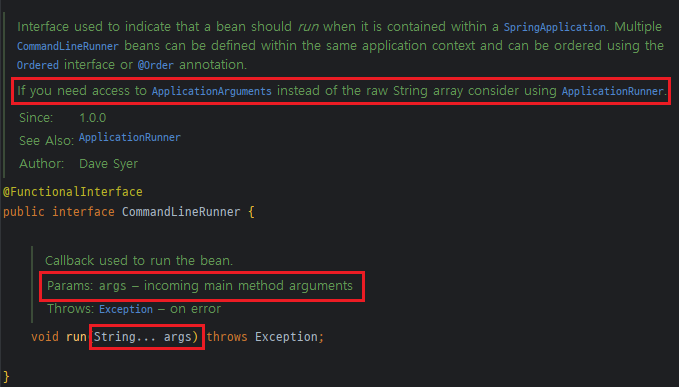
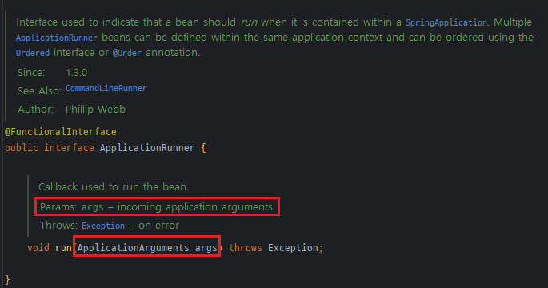
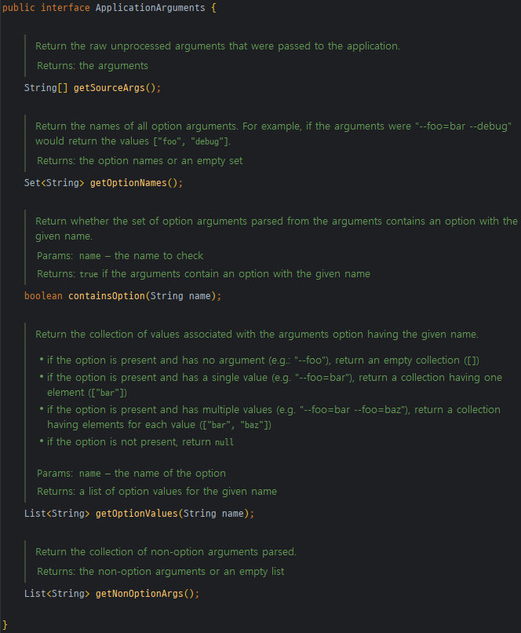
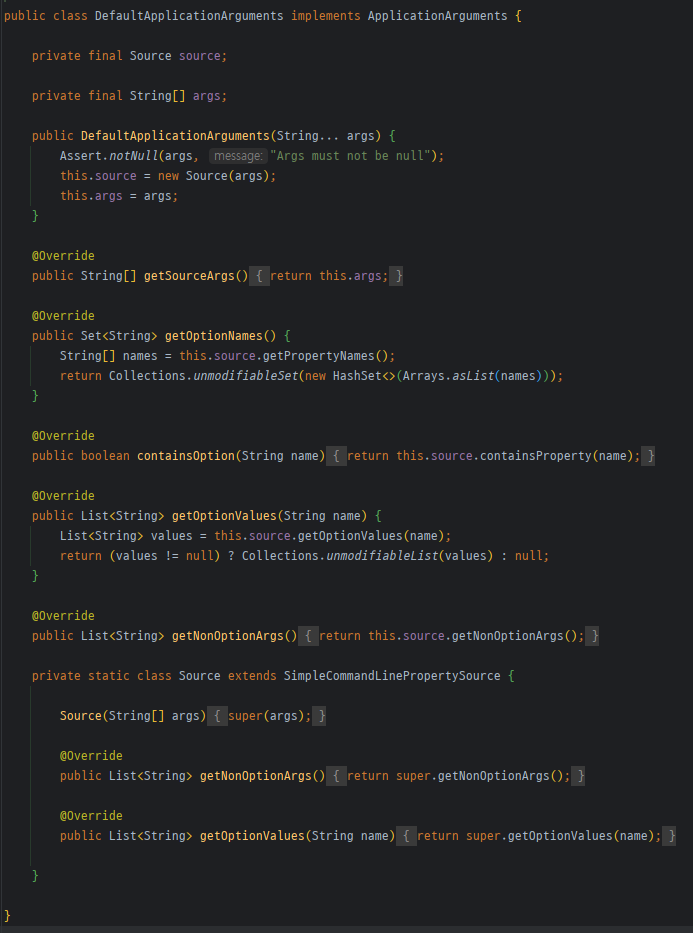

# study-spring-boot-inject-initializer-code

```
토비님의 스프링 부트 앱에 초기화 코드를 넣는 방법 3가지 영상을 토대로 학습한 Repository입니다.
```

### 유튜브 영상
[유튜브 영상 바로가기](https://www.youtube.com/watch?v=f017PD5BIEc)

### 내용
Spring Boot에서 초기화 코드를 넣는 방법에는 아래 3가지 방법이 있습니다.
1. CommandLineRunner
2. ApplicationRunner
3. @EventListener






```
CommandLineRunner와 ApplicationRunner를 비교해보면 위와 같습니다.

CommandLineRunner는 main() 메서드에서 전달된 인자들이 파라미터로 넘어온다고 하며
이때 String[] 형태로 넘어오게 됩니다.

반면 ApplicationRunner는 application arguments가 파라미터로 넘어온다고 하며
이때 파라미터는 ApplicationArguments 객체로 래핑하여 넘어오게 됩니다.

ApplicationArguments interface는 기본적으로 구현체가 한 개 있는데 DefaultApplicationArguments 입니다.
이 객체는 CommandLineRunner와 같이 main() 메서드에서 전달된 인자들이 파라미터로 넘어오는데,
이 파라미터를 가지고 추가 작업이 진행됩니다.
관려해서 CommandLine Arguments vs CommandLine Option Arguments에 대해 찾아보시면 됩니다.

해당 내용은 김영한님의 스프링 부트 강의를 학습하여 작성한 포스팅에 정리해두었으니
해당 링크를 참고하시면 좋을 것 같습니다.
```

[CommandLine Arguments vs CommandLine Option Arguments](https://soono-991.tistory.com/37?category=1078163)


