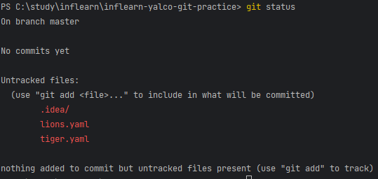
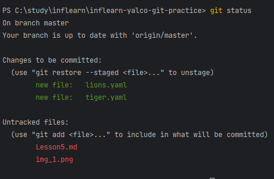
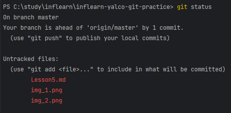

# Lesson5. Git 설정 & 프로젝트 관리 시작하기

### git status
- untracted
- unmodified
- modified
- staged
- committed

### Untracked

lions.yaml, tiger.yaml을 생성한 후 
git status 명령어를 실행하면 커밋은 없지만 untracked file이 존재한다는 메시지와 함께 untracked file 목록이 출력됨

### staged
lions.yaml, tiger.yaml을 커밋하기 위해서는 Staging Area에 올려야 하는데,
이 때 lions.yaml, tiger.yaml 파일의 상태는 staged 상태입니다.

### committed

lions.yaml, tiger.yaml을 커밋하게 되면 staged 상태에서 committed 상태로 변경됩니다.

