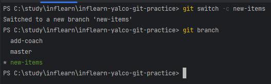
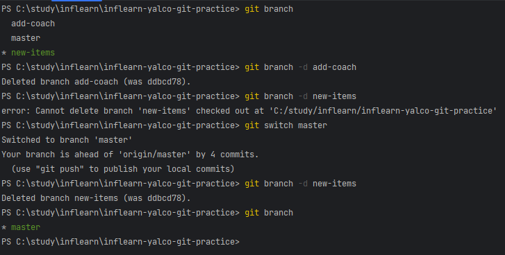

# Lesson1. 여러 branch 만들어보기

### branch 조회
`git branch`

### branch 생성
`git branch [branch-name]`

### branch 이동
`git switch [branch-name]`

### branch 생성 + 이동
`git swtich -c [branch-name]`

### branch 제거
`git branch -d [branch-name]`

`🔔 현재 선택된 branch는 제거 불가능`

### branch 이름 변경
`git branch -m [old branch-name] [new branch-name]`

